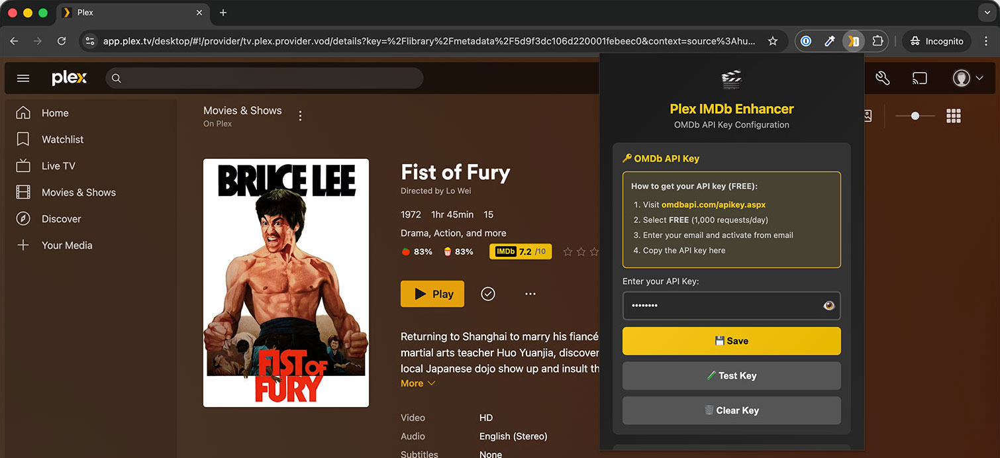
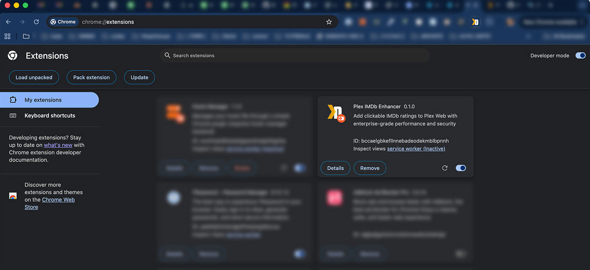

# Plex IMDb Enhancer

Add clickable IMDb ratings to Plex Web.


## Screenshots

### Extension in Action


### Extension Installation


## Features

- **IMDb button** with live ratings in movie details
- **Click to open** IMDb page in new tab
- **Plex API integration** (optional) - uses original titles for accurate matching
- **Intelligent fallback** - Plex metadata → OMDb API
- **Bilingual support** (English/Romanian)
- **Quick Setup** - paste one URL to configure Plex integration
- **Performance optimized** with caching and rate limiting
- **Auto-reload** credentials on configuration changes

## Requirements

- Chrome/Edge/Brave (v88+) or Firefox (v109+)
- Free OMDb API key - [get one here](http://www.omdbapi.com/apikey.aspx)
- Plex Web account

## Installation

### 1. Get API Key

1. Visit [omdbapi.com/apikey.aspx](http://www.omdbapi.com/apikey.aspx)
2. Select **FREE** (1,000 requests/day)
3. Activate via email
4. Save your key

### 2. Install Extension

**Quick Method (Recommended):**
```bash
cd plex-imdb-extension

# For Chrome/Edge/Brave:
./switch-browser.sh chrome

# For Firefox:
./switch-browser.sh firefox
```

Then load the extension:
- **Chrome/Edge:** `chrome://extensions/` → Enable Developer mode → Load unpacked
- **Firefox:** `about:debugging#/runtime/this-firefox` → Load Temporary Add-on → Select `manifest.json`

---

**Manual Method:**

**Chrome/Edge/Brave:**
1. Download this repository
2. Use `./switch-browser.sh chrome` or copy `manifest-chrome.json` to `manifest.json`
3. Go to `chrome://extensions/`
4. Enable **Developer mode**
5. Click **Load unpacked**
6. Select `plex-imdb-extension` folder

**Firefox:**
1. Download this repository
2. Keep `manifest.json` as is (already Firefox-compatible)
3. Go to `about:debugging#/runtime/this-firefox`
4. Click **Load Temporary Add-on**
5. Select `manifest.json`

**Note:** We provide separate manifests because:
- Chrome/Edge: Uses `service_worker` (MV3 optimized)
- Firefox: Uses `scripts` (MV3 compatible, service workers not fully supported yet)

### 3. Configure OMDb API Key (Required)

1. Click extension icon in toolbar
2. Enter OMDb API key
3. Click **Save**

### 4. Configure Plex Integration (Optional - Recommended)

**Why?** Enables better title matching using original titles from Plex metadata. Fixes issues like "The Octopus" vs "La Piovra".

**Quick Setup (recommended):**
1. Click extension icon → **Advanced Settings**
2. In Plex, go to any movie → ⋮ (three dots) → **Get Info** → **View XML**
3. Copy the **full URL** from browser address bar
4. Paste into **Quick Setup** field
5. Done! Token and server URL extracted automatically ✨

**Manual Setup:**
1. From the XML URL, copy:
   - **Token:** `X-Plex-Token=...` value
   - **Server URL:** `https://...plex.direct:32400` (before `/library`)
2. Enter in respective fields
3. Click **Test Plex Connection** to verify
4. Click **Save Plex Settings**

## Usage

1. Open [Plex Web](https://app.plex.tv)
2. Navigate to any movie
3. IMDb button appears with ratings
4. Click to open IMDb page

## File Structure

```
plex-imdb-extension/
├── manifest.json          # Active manifest (switch with script)
├── manifest-chrome.json   # Chrome manifest (service_worker)
├── manifest-firefox.json  # Firefox manifest (scripts)
├── background-chrome.js   # Chrome background (service worker)
├── background-firefox.js  # Firefox background (scripts)
├── switch-browser.sh      # Browser switcher
├── config.js              # Configuration & constants
├── logger.js              # Logging system
├── storage-utils.js       # Storage utilities
├── validators.js          # Input validation
├── url-utils.js           # URL parsing
├── cache.js               # LRU cache
├── rate-limiter.js        # Rate limiting
├── api-client.js          # OMDb API client
├── plex-api-client.js     # Plex API client
├── metadata-resolver.js   # Metadata resolution
├── content.js             # Content script
├── popup.html             # Settings UI
├── popup.js               # Popup logic
├── _locales/              # Translations (EN/RO)
├── icons/                 # Extension icons
└── .github/workflows/     # CI/CD (release automation)
```

## Technical Details

**Architecture:**
- Modular design with separate concerns
- Manifest V3 compliant (separate manifests for Chrome/Firefox)
  - `manifest.json` - Firefox (scripts-based)
  - `manifest-chrome.json` - Chrome/Edge (service_worker)
- Duplicate injection prevention
- Memory leak protection
- DRY code with reusable utilities (validators, url-utils, storage-utils)

**Performance:**
- API response caching (60min TTL)
- Rate limiting (100 req/hour)
- Optimized DOM queries
- <5MB memory footprint

**Security:**
- XSS protection with input sanitization
- Content Security Policy (CSP) enforcement
- No external tracking or analytics
- ReDoS protection on regex patterns
- API key validation

## 🔒 Security & Privacy

### Token Storage

**⚠️ IMPORTANT: Tokens are stored in plaintext**

This extension stores your OMDb API key and Plex token in **browser storage** (chrome.storage.sync). This data is **NOT encrypted**.

**What this means:**
- ✅ Your data stays in your browser (not sent to external servers)
- ⚠️ Malicious browser extensions with `storage` permission can read your tokens
- ⚠️ Anyone with physical access to your computer could extract tokens

### What Someone Can Do With Your Tokens

**If someone steals your Plex token + server URL:**

**❌ CANNOT do:**
- Access your Plex account credentials (username/password)
- Change your Plex account settings
- Access billing information or payment methods
- Access other Plex servers you don't own
- Delete or modify your media files
- Install apps or modify server settings (requires admin access)

**✅ CAN do:**
- View your Plex library metadata (movie titles, descriptions, ratings)
- See what media is on YOUR Plex server (the one you configured)
- Access thumbnails and posters
- Play media from your server (if they know the direct URLs)

**Worst case scenario:**
Someone could browse your Plex library and stream your content. They **cannot** access your Plex account, billing, or server administration.

### Protection & Mitigation

**Best practices:**
1. ✅ **Only install trusted browser extensions** - Check reviews and permissions
2. ✅ **Review extension permissions** - Be cautious of extensions requesting `storage` access
3. ✅ **Use plex.direct URLs with HTTPS** - Ensures encrypted communication
4. ✅ **Don't share your browser profile** - Each user should have their own profile

**If you suspect your token is compromised:**

1. **Revoke Plex token immediately:**
   - Open Plex Web → Settings → Network
   - Scroll to "Webhooks" → Show Advanced
   - Clear all auth tokens (forces re-authentication)
   - Or sign out from all devices

2. **Clear extension settings:**
   - Open extension popup → Advanced Settings
   - Click "Clear Plex Settings"
   - Click "Clear Key" for OMDb

3. **Generate new tokens:**
   - Get a new OMDb API key from [omdbapi.com/apikey.aspx](http://www.omdbapi.com/apikey.aspx)
   - Reconfigure Plex integration with new token

**Why we don't encrypt:**
- Encryption without user password provides **false security** (malicious extensions could decrypt using the same logic)
- User password encryption would require re-entering password on every browser restart (poor UX)
- Plex tokens are **revocable** - if compromised, you can invalidate them instantly
- This is **standard practice** for browser extensions (Gmail, Trello, GitHub extensions all store tokens in plaintext)

### Privacy

- ✅ No data sent to external servers (except OMDb API and your Plex server)
- ✅ No analytics or tracking
- ✅ No telemetry
- ✅ Open source - verify the code yourself

## Troubleshooting

**Button doesn't appear:**
- Verify you're on a movie details page
- Reload page (Ctrl+R)
- Check API key is configured
- Open Console (F12) for errors

**API key issues:**
- Ensure key is activated via email
- Test: `http://www.omdbapi.com/?apikey=YOUR_KEY&t=Inception`
- Free limit: 1,000 requests/day

## Development

```bash
git clone https://github.com/Bibi40k/plex-imdb-extension
cd plex-imdb-extension
```

**Switching between browsers:**

Use the provided script to easily switch manifests:

```bash
# Switch to Chrome/Edge
./switch-browser.sh chrome

# Switch to Firefox
./switch-browser.sh firefox

# Check current manifest
./switch-browser.sh
```

The script automatically:
- ✅ Switches between `manifest-chrome.json` and `manifest-firefox.json`
- ✅ Shows which browser configuration is active
- ✅ No backups needed (use Git for version control)

**Debug logging:**
Set `LOG_LEVEL: 'debug'` in `config.js`

**Manual switching (if needed):**
```bash
# For Chrome
cp manifest-chrome.json manifest.json

# For Firefox
cp manifest-firefox.json manifest.json
```

## Releasing

The extension is released separately for Chrome and Firefox using **GitHub Actions**.

**Release Process:**

1. **Update version** in all manifests:
   ```bash
   # Update version in:
   # - manifest.json
   # - manifest-chrome.json
   # - manifest-firefox.json
   ```

2. **Update CHANGELOG.md** with release notes

3. **Commit changes:**
   ```bash
   git add .
   git commit -m "Release v0.2.0"
   ```

4. **Create and push version tag:**
   ```bash
   git tag v0.2.0
   git push origin main --tags
   ```

5. **GitHub Actions automatically:**
   - Builds Chrome package (`plex-imdb-extension-chrome-v0.2.0.zip`)
   - Builds Firefox package (`plex-imdb-extension-firefox-v0.2.0.zip`)
   - Creates GitHub Release with both packages
   - Adds release notes from tag

6. **Download packages from GitHub Release:**
   - Upload Chrome package to [Chrome Web Store](https://chrome.google.com/webstore/devconsole)
   - Upload Firefox package to [Firefox Add-ons (AMO)](https://addons.mozilla.org/developers)

**What's different between releases:**

| Feature | Chrome | Firefox |
|---------|--------|---------|
| Manifest | `manifest-chrome.json` | `manifest-firefox.json` |
| Background | `service_worker: background-chrome.js` | `scripts: [background-firefox.js]` |
| Test Plex Button | ✅ Works | ✅ Works |

**GitHub Actions Workflow:**

The release workflow (`.github/workflows/release.yml`) is triggered automatically when you push a version tag (`v*`). It builds both packages in CI and attaches them to the GitHub Release.

## Changelog

### v0.2.0 (2026-02-09)
- **Plex API Integration** - fetch metadata directly from Plex Media Server
- **Intelligent metadata resolver** - Plex → OMDb fallback chain
- **Quick Setup** - paste one URL to extract token + server URL
- **Auto-reload credentials** - storage change detection
- **Original title support** - fixes international title mismatches
- **Test Plex Connection** button
- **[PIMDB]** logging prefix for easy console filtering
- Improved security documentation

### v0.1.1 (2026-02-09)
- Fixed rate limiter memory leak
- Fixed XSS in i18n rendering
- Added request timeout handling
- Improved error handling in storage operations
- Cache performance optimization
- ReDoS protection

### v0.1.0 (2026-02-09)
- Initial release
- Bilingual support (EN/RO)
- Secure API key handling
- Caching and rate limiting
- Memory leak fixes
- XSS protection

## License

MIT License - see [LICENSE](LICENSE)

## Credits

- [OMDb API](http://www.omdbapi.com/) for IMDb data
- [Plex](https://www.plex.tv/) for the platform
